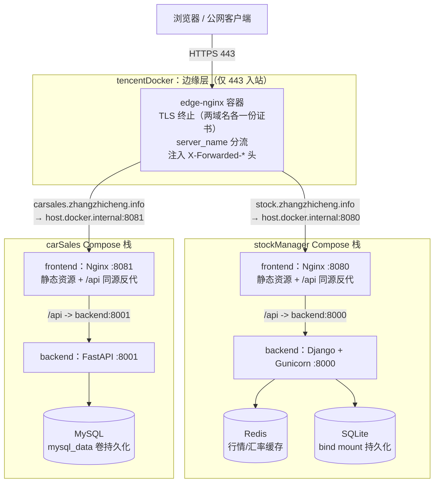

# 在 OpenCloudOS 上从零部署 stockManager、carSales 与外层 Nginx

本文面向一台全新的 **OpenCloudOS**（或兼容的 RHEL 系）Linux 服务器，目标是在同一台机器上运行 **stockManager**、**carSales** 两套 Docker Compose 栈，并用 **[tencentDocker/docker](../docker/)** 中的 **Nginx 边缘反代** 仅对外暴露 **HTTPS 443**，将两个域名分别指到两套前端。

## 架构总览

整体采用 **「边缘层 + 业务层」两级结构**：一个极薄的边缘 Nginx 负责 TLS 与按域名分流，两套业务系统各自是一个完整、自治的 Compose 栈。



### 设计思路与取舍

**1. 边缘层与业务层解耦。** 两套业务栈在各自仓库内即可独立构建、独立 `up/down`，本地开发时不依赖边缘层；`tencentDocker` 只承载「这台服务器如何对外」这一件事（证书、域名、端口策略）。换服务器、加第三个站点、替换某套业务，都只改动各自一侧，互不牵连。

**2. 用宿主机端口作为两层之间的契约，而非共享 Docker 网络。** 边缘 Nginx 通过 **`host.docker.internal`**（Compose 中已配置 `extra_hosts: host.docker.internal:host-gateway`）回连宿主机上的 **8080 / 8081**。备选方案是让三套 Compose 共享一个外部 Docker 网络、边缘层直接以容器名访问上游，网络路径更短，但会让三个本应独立的项目在网络定义上互相耦合（任何一方重建网络都影响其他方）。这里选择以「宿主机端口」为边界：约定简单、可独立用 `curl 127.0.0.1:8080` 自检，代价是上游多过一跳 NAT，对本场景的流量规模可忽略。

**3. TLS 只在边缘终止一次。** 证书集中放在 `tencentDocker/docker/ssl/`，业务栈内部全部走明文 HTTP，不需要各自管理证书与续期。边缘层向上游注入 `X-Forwarded-Proto` / `X-Forwarded-For` / `X-Real-IP`，使后端（尤其是 Django 的 CSRF 校验）能感知真实协议与客户端 IP——这也是第 4 节中 `CSRF_TRUSTED_ORIGINS_EXTRA` 必须填 `https://` 完整源的原因。

**4. 仅暴露 443，不开 80。** 不做 HTTP→HTTPS 跳转，公网攻击面只有一个 TLS 端口；8080/8081/8000/8001 仅供本机与容器访问，安全组无需放行。若日后需要 80 跳转，只需在边缘层补一个 `return 301` 的 server 块并映射 80，业务层不动。

**5. 配置即模板，环境差异收敛到 `.env`。** 边缘 Nginx 使用官方镜像的 envsubst 模板机制（`templates/*.conf.template` 渲染到 `conf.d/`），上游地址由 `STOCK_FRONTEND_UPSTREAM` / `CARSALES_FRONTEND_UPSTREAM` 注入；并通过 **`NGINX_ENVSUBST_FILTER`** 限定只替换这两个变量，避免 envsubst 误替换 `$host`、`$remote_addr` 等 Nginx 运行期变量（这是该机制最常见的坑，见第 12 节常见问题）。

**6. 业务栈内部自治、互不感知。** 每套业务栈自带「前端 Nginx + 后端 + 存储」：前端容器内的 Nginx 既托管静态资源，又把 `/api` 同源反代到本栈后端，因此边缘层只需把整个域名指向前端一个上游，无需关心后端路由。两套栈通过 **`COMPOSE_PROJECT_NAME`**（`stockmanager` / `carsales`）隔离容器名、网络与卷的命名空间，同机共存不冲突。

### 请求链路

以浏览器访问 `https://stock.zhangzhicheng.info/api/...` 为例：

1. DNS 解析到服务器公网 IP，安全组/防火墙仅放行 443；
2. **edge-nginx** 完成 TLS 握手，按 `server_name` 命中 stock 的 server 块，附加 `X-Forwarded-*` 头后转发到 `host.docker.internal:8080`；
3. **stockManager 前端容器的 Nginx** 收到请求：静态资源直接返回，`/api` 前缀反代到同栈 `backend:8000`；
4. **Django 后端** 依据 `X-Forwarded-Proto` 通过 CSRF 同源校验，读写 SQLite / Redis 后返回；
5. 响应原路返回。carSales 链路同理（8081 → FastAPI → MySQL）。

### 端口约定

| 组件 | 宿主机端口 | 说明 |
|------|------------|------|
| stockManager 前端 | **8080** | `FRONTEND_PUBLISH_PORT` 默认 |
| carSales 前端 | **8081** | `FRONTEND_PUBLISH_PORT` 默认（避免与 8080 冲突） |
| stockManager 后端 | 8000 | 可选映射，外层 Nginx 不要求对外暴露 |
| carSales 后端 | 8001 | 可选映射 |
| 外层 Nginx | **443** | 仅监听 TLS，证书放在 `tencentDocker/docker/ssl/` |

两套业务栈需先在本机把前端端口按上表映射起来，边缘 Nginx 才能回连成功。若改动端口，需同步修改 `tencentDocker/docker/.env` 中对应的 `*_UPSTREAM`。

## 1. 系统准备

```bash
sudo dnf update -y
sudo dnf install -y git curl ca-certificates
```

可选：创建部署目录（路径可自定，下文以 `/opt/apps` 为例）：

```bash
sudo mkdir -p /opt/apps
sudo chown "$USER:$USER" /opt/apps
cd /opt/apps
```

## 2. 安装 Docker 与 Compose 插件

**可以**用 **`dnf` 安装 Docker**。OpenCloudOS 官方容器指南中，系统仓库已提供 Docker Engine（参见 [OpenCloudOS 容器用户指南 — 安装容器](https://docs.opencloudos.org/OCS/Virtualization_and_Containers_Guide/Docker_guide/)），任选其一即可（不要混装多套引擎）：

```bash
sudo dnf install -y docker
# 或与 moby 二选一（与上一行择一即可）：
# sudo dnf install -y moby
```

启动并验证 Engine：

```bash
sudo systemctl enable --now docker
docker --version
```

**Docker Compose V2**（`docker compose` 子命令）是否随 `docker` 包一起提供，取决于具体版本与软件源。请先检查：

```bash
docker compose version
```

若已能输出版本号，则无需再装 Compose。若提示没有 `compose` 子命令或命令不存在，可按下述顺序处理：

1. **用 dnf 安装 Compose 插件**（若仓库中有该包，名称可能因源而异，可先搜索）：

   ```bash
   sudo dnf search docker-compose
   sudo dnf install -y docker-compose-plugin
   ```

   再次执行 `docker compose version` 确认。

2. **改用 Docker 官方仓库的 CE 版**（与 [Docker 在 CentOS 上的安装说明](https://docs.docker.com/engine/install/centos/) 一致；若已从系统源安装过 `docker`/`moby`，需按官方文档卸载/避免冲突后再装 `docker-ce`、`docker-compose-plugin`）。

3. **兜底**：单独下载 Compose v2 二进制并放入 `PATH`（维护成本较高，一般优先用插件包或官方源）。

将当前用户加入 `docker` 组（需重新登录生效）：

```bash
sudo usermod -aG docker "$USER"
```

## 3. 克隆三个仓库

在 `/opt/apps`（或你的目录）下克隆 **stockManager**、**carSales**、**tencentDocker**（地址替换为你自己的远程 URL）：

```bash
cd /opt/apps
git clone <你的 stockManager 仓库 URL> stockManager
git clone <你的 carSales 仓库 URL> carSales
git clone <你的 tencentDocker 仓库 URL> tencentDocker
```

## 4. 配置 stockManager

```bash
cd /opt/apps/stockManager
cp docker/.env.example docker/.env
```

编辑 `docker/.env`，至少设置：

- **`DJANGO_SECRET_KEY`**：足够长的随机字符串（生产勿用示例值）。
- **`DJANGO_DEBUG`**：生产建议 `false`。
- **`CSRF_TRUSTED_ORIGINS_EXTRA`**：通过 HTTPS 域名访问时必填，例如：  
  `https://stock.zhangzhicheng.info`  
  （多个源用英文逗号分隔，须与浏览器地址栏协议、主机名、端口一致。）

`FRONTEND_PUBLISH_PORT=8080`、`BACKEND_PUBLISH_PORT=8000` 可与默认一致。保留 **`COMPOSE_PROJECT_NAME=stockmanager`**（`.env.example` 默认），与 carSales 同机时勿删。

启动：

```bash
docker compose -f docker/docker-compose.yml --env-file docker/.env build
docker compose -f docker/docker-compose.yml --env-file docker/.env up -d
```

## 5. 配置 carSales

```bash
cd /opt/apps/carSales
cp docker/.env.example docker/.env
```

编辑 `docker/.env`，设置 **`MYSQL_ROOT_PASSWORD`**、**`DB_PASSWORD`** 等（详见 carSales 仓库内 `docker/README.md`）。默认 **`FRONTEND_PUBLISH_PORT=8081`**，与 stockManager 同机部署时勿改回 8080，以免端口冲突。保留 **`COMPOSE_PROJECT_NAME=carsales`**（`.env.example` 默认）。

启动：

```bash
docker compose -f docker/docker-compose.yml --env-file docker/.env build
docker compose -f docker/docker-compose.yml --env-file docker/.env up -d
```

## 6. 本机验证（可选）

在服务器上：

```bash
curl -fsS -o /dev/null -w "%{http_code}\n" http://127.0.0.1:8080/
curl -fsS -o /dev/null -w "%{http_code}\n" http://127.0.0.1:8081/
```

期望均为 **200**（或业务定义的合法状态码）。

## 7. TLS 证书（统一目录）

证书与私钥**不入 Git**（见仓库 `.gitignore`），`git clone` / `git pull` 后 **`docker/ssl/` 下各域名子目录会是空的**，属正常现象。须在**服务器上**手动放置文件；边缘 Nginx 通过 `./ssl:/etc/nginx/ssl:ro` 只读挂载读取。

在 **`tencentDocker/docker/ssl/`** 下按域名分子目录放置（**文件名须与** [`docker/templates/zhangzhicheng.conf.template`](../docker/templates/zhangzhicheng.conf.template) **一致**）：

**stock**（腾讯云下载 Nginx 格式后，将下列两个文件放入 `ssl/stock.zhangzhicheng.info/`，`.csr` 不必上传）：

```
tencentDocker/docker/ssl/stock.zhangzhicheng.info/stock.zhangzhicheng.info_bundle.pem
tencentDocker/docker/ssl/stock.zhangzhicheng.info/stock.zhangzhicheng.info.key
```

**carsales**（同样规则；若使用 Let's Encrypt / certbot，将 `fullchain.pem` / `privkey.pem` 复制或软链为下列文件名，或改 Nginx 模板）：

```
tencentDocker/docker/ssl/carsales.zhangzhicheng.info/carsales.zhangzhicheng.info_bundle.pem
tencentDocker/docker/ssl/carsales.zhangzhicheng.info/carsales.zhangzhicheng.info.key
```

若云厂商仅提供 `*_bundle.crt`，内容与 `.pem` 相同，复制为同名 `.pem` 即可，例如：

```bash
cp stock.zhangzhicheng.info_bundle.crt stock.zhangzhicheng.info_bundle.pem
```

私钥权限建议 `chmod 600`；通过只读挂载进容器即可，无需重建业务栈镜像。

## 8. 启动外层 Nginx（仅 443）

```bash
cd /opt/apps/tencentDocker/docker
cp .env.example .env
# 若你修改了两套前端的宿主机端口，编辑 .env 中的 STOCK_FRONTEND_UPSTREAM / CARSALES_FRONTEND_UPSTREAM
docker compose --env-file .env up -d
```

Compose 仅映射 **`443:443`**，不暴露 80。模板中的上游默认：

- `host.docker.internal:8080` → stockManager 前端
- `host.docker.internal:8081` → carSales 前端

## 9. 防火墙与安全组

- 本机 **firewalld**（若启用）：放行 **443/tcp**，例如：  
  `sudo firewall-cmd --permanent --add-service=https && sudo firewall-cmd --reload`
- 云厂商安全组：入站允许 **443** 到该实例。

无需对公网开放 8080/8081（仅本机与 Docker 访问即可）；若仅内网访问，可在后续用防火墙限制回环或 Docker 网桥访问策略。

## 10. DNS

为以下域名添加 **A 记录**（或 AAAA）指向该服务器公网 IP：

- `stock.zhangzhicheng.info`
- `carsales.zhangzhicheng.info`

## 11. 最终验证

在任意可解析上述域名的机器上：

```bash
curl -fsS -o /dev/null -w "%{http_code}\n" https://stock.zhangzhicheng.info/
curl -fsS -o /dev/null -w "%{http_code}\n" https://carsales.zhangzhicheng.info/
```

浏览器访问两个 HTTPS 站点，确认页面与接口（同源 `/api` 等）正常。

查看边缘 Nginx 日志：

```bash
cd /opt/apps/tencentDocker/docker
docker compose --env-file .env logs --tail=100 edge-nginx
```

## 12. 常见问题

| 现象 | 处理 |
|------|------|
| 边缘 Nginx 启动失败，报 certificate 找不到 | 确认四个 PEM 路径与文件名正确，且目录已挂载。 |
| 边缘 Nginx `invalid variable name in nginx.conf:32`、反复重启 | 多为 `envsubst` 误替换 `$host` 等：确认 `docker-compose.yml` 已设 `NGINX_ENVSUBST_FILTER`，模板里 Nginx 变量用单个 `$`；重建容器后 `docker exec tencent-edge-nginx cat /etc/nginx/conf.d/zhangzhicheng.conf` 检查不应出现 `$$host`。 |
| 日志里 `listen ... http2` is deprecated | 可忽略，或拉取最新模板（已改为 `listen 443 ssl` + `http2 on`）。 |
| `502 Bad Gateway` | 确认两套 Compose 已 `up`，且 `.env` 中上游端口与 `FRONTEND_PUBLISH_PORT` 一致；在服务器上 `curl http://127.0.0.1:8080/` 自检。 |
| stock 站点 **`/static/umi.*` 404** | stockManager 前端 `publicPath=/static/`，构建文件在镜像 html 根目录。确认 `stockManager/docker/nginx.conf` 中 `/static/` 使用 `alias`（非 `root`），然后 `docker compose ... build frontend && up -d`。 |
| stockManager **403 CSRF** | 检查 **`CSRF_TRUSTED_ORIGINS_EXTRA`** 是否包含当前访问的 `https://` 完整源；确认外层 Nginx 已设置 `X-Forwarded-Proto`（模板中已包含）。 |
| `host.docker.internal` 解析失败 | 需 Docker **20.10+** 且 compose 中保留 **`extra_hosts: host.docker.internal:host-gateway`**。 |
| 仅 IPv6 或复杂网络 | 若 `host-gateway` 行为异常，可改为将边缘 Nginx 改为 **`network_mode: host`** 并改用 `127.0.0.1:端口` 上游（需自行改写 compose，与当前仓库默认不同）。 |

## 13. 更新与维护

### 13.1 代码与配置

代码更新后，在各项目根目录 `git pull`，再执行对应项目的 `docker compose ... build && up -d`。仅改 `tencentDocker/docker/.env` 时，在 `tencentDocker/docker` 下执行 `docker compose --env-file .env up -d` 即可。

### 13.2 更新 TLS 证书（两个域名）

证书续期或重新签发后，**只需在服务器上覆盖 `docker/ssl/` 内文件并重载边缘 Nginx**，无需 `git pull`、无需重建 stockManager / carSales 业务栈。

#### 目录与文件名速查

| 域名 | 服务器目录 | 证书链文件 | 私钥文件 |
|------|------------|------------|----------|
| stock | `docker/ssl/stock.zhangzhicheng.info/` | `stock.zhangzhicheng.info_bundle.pem` | `stock.zhangzhicheng.info.key` |
| carsales | `docker/ssl/carsales.zhangzhicheng.info/` | `carsales.zhangzhicheng.info_bundle.pem` | `carsales.zhangzhicheng.info.key` |

下文以部署目录 **`/opt/apps/tencentDocker/docker`** 为例；若路径不同，请替换为你的实际路径。

#### 步骤一：获取新证书

**腾讯云 SSL（推荐，与当前 stock / carsales 一致）**

1. 登录 [腾讯云 SSL 证书控制台](https://console.cloud.tencent.com/ssl)。
2. 对 `stock.zhangzhicheng.info`、`carsales.zhangzhicheng.info` 分别续期或重新申请并签发。
3. 下载时选择 **Nginx** 格式；解压后每个域名通常得到 `*_bundle.crt`（或 `.pem`）与 `*.key`。
4. 将 `.crt` 重命名或复制为上一表中的 `*_bundle.pem`（内容与 `.pem` 相同）。

**Let's Encrypt / certbot（可选）**

若用 ACME 签发，常见文件为 `fullchain.pem` 与 `privkey.pem`，需对应复制为上一表中的 bundle / key 文件名，或修改 Nginx 模板中的 `ssl_certificate` 路径。

#### 步骤二：上传到服务器

在**本机**（已解压证书的机器）执行，将 `<用户>`、`<服务器IP>` 换成实际值：

```bash
# 确保目录存在
ssh <用户>@<服务器IP> "mkdir -p /opt/apps/tencentDocker/docker/ssl/stock.zhangzhicheng.info \
  /opt/apps/tencentDocker/docker/ssl/carsales.zhangzhicheng.info"

# stock 域名
scp ./stock.zhangzhicheng.info_bundle.pem <用户>@<服务器IP>:/opt/apps/tencentDocker/docker/ssl/stock.zhangzhicheng.info/
scp ./stock.zhangzhicheng.info.key           <用户>@<服务器IP>:/opt/apps/tencentDocker/docker/ssl/stock.zhangzhicheng.info/

# carsales 域名
scp ./carsales.zhangzhicheng.info_bundle.pem <用户>@<服务器IP>:/opt/apps/tencentDocker/docker/ssl/carsales.zhangzhicheng.info/
scp ./carsales.zhangzhicheng.info.key        <用户>@<服务器IP>:/opt/apps/tencentDocker/docker/ssl/carsales.zhangzhicheng.info/
```

也可在服务器上用 `sftp`、面板上传等方式写入同一路径。两个域名可**分别**更新（只换其中一个目录、只重载 Nginx 即可）。

#### 步骤三：权限与重载 Nginx

在**服务器**上：

```bash
cd /opt/apps/tencentDocker/docker

chmod 644 ssl/*/*_bundle.pem
chmod 600 ssl/*/*.key

docker compose --env-file .env restart edge-nginx
```

若 `restart` 后仍报旧证书或找不到文件，可强制重建边缘容器：

```bash
docker compose --env-file .env up -d --force-recreate edge-nginx
```

#### 步骤四：验证

```bash
# 容器内是否挂载到新文件（各应有两个文件）
docker exec tencent-edge-nginx ls -la /etc/nginx/ssl/stock.zhangzhicheng.info/
docker exec tencent-edge-nginx ls -la /etc/nginx/ssl/carsales.zhangzhicheng.info/

# HTTPS 可达
curl -fsS -o /dev/null -w "%{http_code}\n" https://stock.zhangzhicheng.info/
curl -fsS -o /dev/null -w "%{http_code}\n" https://carsales.zhangzhicheng.info/

# 查看证书有效期（可选）
openssl s_client -connect stock.zhangzhicheng.info:443 -servername stock.zhangzhicheng.info </dev/null 2>/dev/null \
  | openssl x509 -noout -dates -subject
openssl s_client -connect carsales.zhangzhicheng.info:443 -servername carsales.zhangzhicheng.info </dev/null 2>/dev/null \
  | openssl x509 -noout -dates -subject
```

失败时查看边缘 Nginx 日志：`docker compose --env-file .env logs --tail=50 edge-nginx`（常见为路径或文件名与模板不一致，见第 12 节）。

---

更多单项目细节见各仓库内文档：

- `stockManager/docker/README.md`
- `carSales/docker/README.md`
